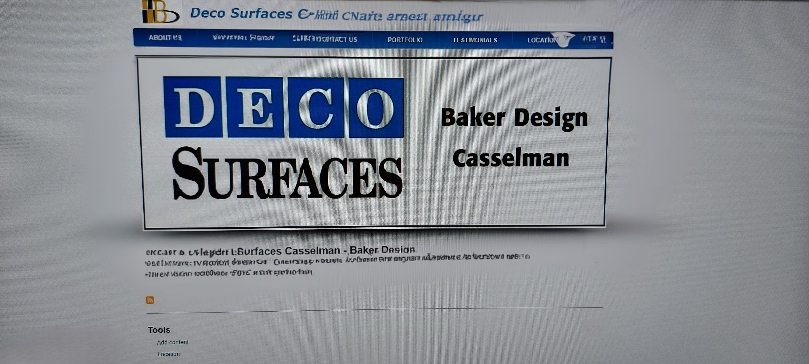
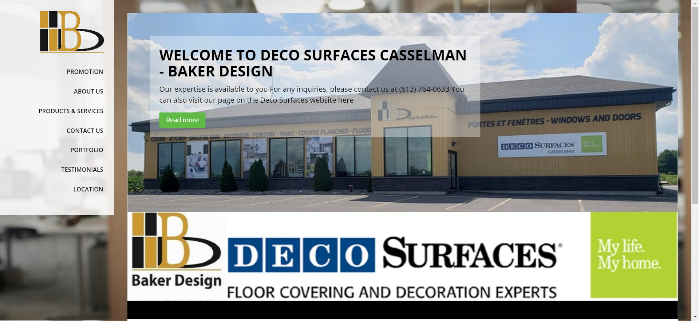
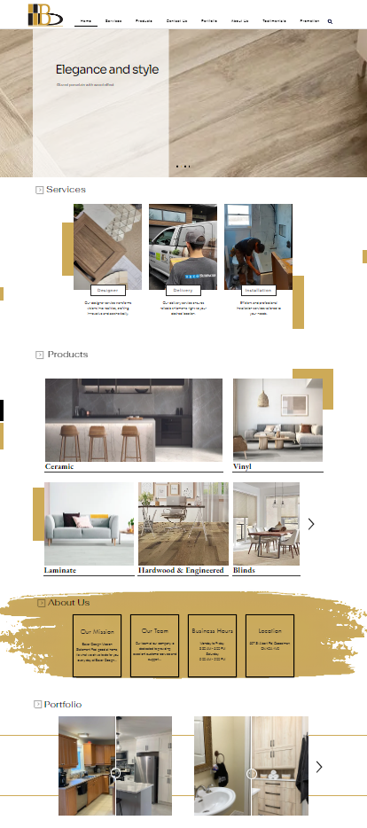
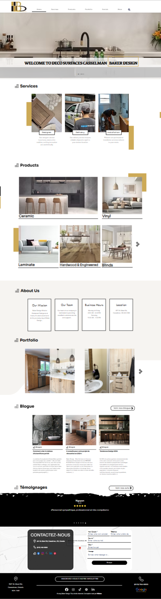
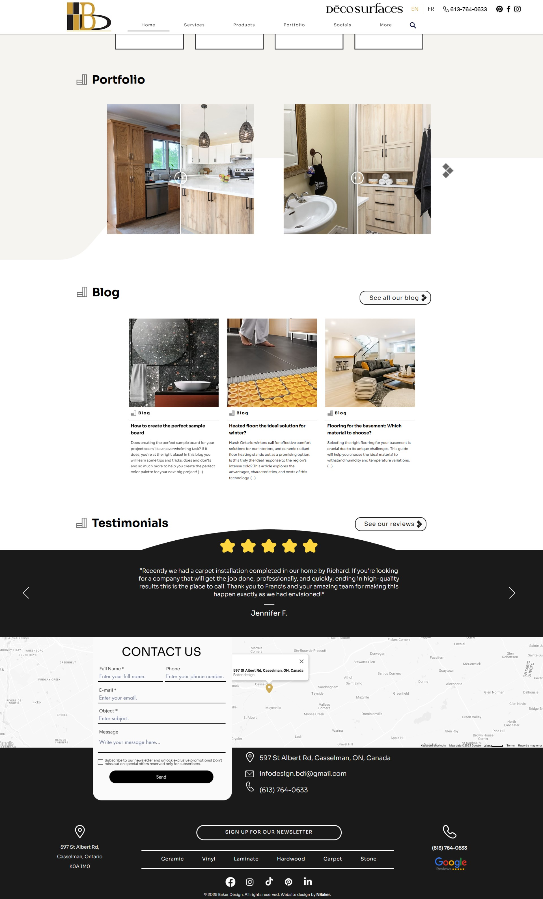

# Projet UX/UI du site Baker Design

## Présentation du projet

Ce projet représente mon travail sur le design UX/UI du site web de Baker Design, une entreprise spécialisée dans le revêtements de sol. Mon implication a commencé lorsque je travaillais en tant que vendeur pour cette entreprise et que j'ai proposé de créer un site web afin d'améliorer leur présence en ligne et leur gestion des produits.

## URL du site web

Version en ligne du site web : [www.baker-design.ca](https://www.baker-design.ca/)

## Objectifs du projet

- Créer un site vitrine présentant l'entreprise et ses produits
- Optimiser l'expérience utilisateur (UX) pour une navigation fluide
- Mettre en place un design moderne et attrayant (UI)
- Ajouter et structurer les informations essentielles sur les produits
- Assurer la compatibilité avec les différents appareils (desktop, mobile)

## Processus de conception UX/UI

1. Première version : Mise en place d'une maquette initiale avec les informations de base.
2. Améliorations : Plusieurs itérations de design ont été effectuées pour optimiser l'expérience utilisateur.
3. Ajout de produits et d'informations : Chaque produit a été ajouté avec ses descriptions et visuels correspondants.
4. Optimisation : Tests et ajustements pour assurer une expérience cohérente sur tous les appareils.
5. Mise en ligne : Publication et suivi de la version finale.

## Versions et évolutions

J'ai documenté l'évolution du design à travers plusieurs versions. Voici un récapitulatif des principales modifications :

| Version | Date | Modifications | Capture d'écran |
|---------|------|---------------|-----------------|
| Version 1 | 2020 | Première version du site web avec une mise en page simple et une liste de produits basique (Avec Drupal 8)|  |
| Version 2 | 2022 | Première refonte avec des améliorations sur le design, la navigation et la mise à jour des informations produits pendant un an (Avec Drupal 8)|  |
| Version 3 | 2023 | Refonte complète du site web avec migration vers Wix, intégration de tous les produits et services, amélioration de l'ergonomie et optimisation des performances |  |
| Version 4 | 2024 | Amélioration de la page d'accueil pour un design plus attrayant et fonctionnel, ajout d'un blog mis à jour tous les deux mois, modernisation des boutons et des formes avec la police Sora |  |
| Version 5 | 2025 | Intégration d'une section 3D sur la page design, refonte du footer, modification de la couleur principale (remplacement du noir par #1A1A1A), amélioration de la section témoignages pour plus de clarté et d'autres mises à jour à venir |  |

## Technologies utilisées

- **Plateforme de création** : Wix
- **Outils graphiques** : Photoshop

## Résultats et impact

- Amélioration de la visibilité en ligne de Baker Design
- Expérience utilisateur optimisée avec un design intuitif
- Présentation efficace des produits et des services de l'entreprise
